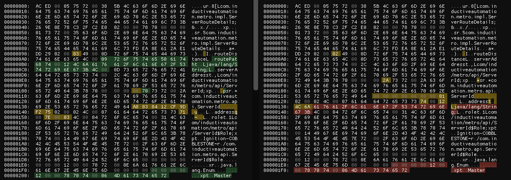

# Ignition GAN Study

## Usage ?

It is in very early stage. Right now it connects and ping.

Test it : `python gan_server.py`

Or a client : `python gan_client.py`

## GAN Server

```mermaid
flowchart TB
    A[Start GAN Server<br/>(WS on 5060, HTTP data on 5088)] --> B[Client connects to<br/>/system/ws-control-servlet (WebSocket)]
    B --> C[WebSocket handshake]
    C --> D[Server sends text frame:<br/>remoteConnectionId=...]
    D --> E[Client sends its identity back]
    E --> F[Client sends PING over WebSocket (ProtocolHeader)]
    F --> G[Server replies with PONG/OK over WebSocket]
    G --> H[Client POST to /system/ws-datachannel-servlet<br/>(chunked) containing MSG_SEND + payload]
    H --> I[Server processes POST:<br/>decodes header, calls on_data_received]
    I --> J[Server sends ACK (OK) over WebSocket]
    I --> K[Server sends reply as MSG_SEND over WebSocket]
    K --> L[Client receives MSG_SEND,<br/>issues GET to /system/ws-datachannel-servlet?id=...&connectionId=...]
    L --> M[Server returns reply in HTTP 200 response body]
    M --> N[Client processes reply payload]
    G --> F2[Repeat PING/PONG to keep alive]

```

## How to create stubs ?

It looks like depending on the Ignition version you use (tested with 8.0X and 8.1X) the payload will change. To understand the classes, you need to take a look at their serialized data



Here for example the `com/inductiveautomation/metro/api/ServerId` is missing the `routePath` String

